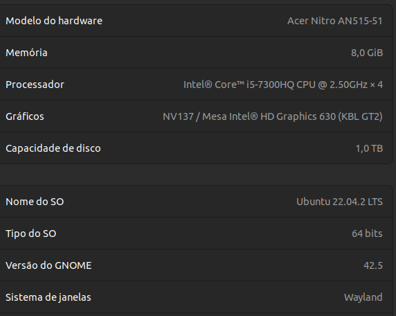

    <h1 >Seminários: Métodos de Ordenação </h1>
    Anderson Rodrigues dos Santos  
    Humberto Henrique Cunha 
    Kauã Lucas de Jesus Silva 
    Algoritmos e Estrutura de Dados I

    <h2>Introdução </h2>
    

        O trabalho consiste na discussão do vários modelos de ordenação que foram explicado na sala de aula. As ordenações escolhidas foram Counting Sort e Pigeonhole Sort, tendo assim, dois algoritmos para a execução. A ideia geral é promover um discussão de qual linguagem é melhor para a determinada ordenação e quais são os melhores entre si.
    

    <h2>Desenvolvimento </h2>
    

        O planejamento do código teve a utilização da linguagem C++, C, Java, PHP, JavaScrip e Python e a implementação dos Counting Sort e Pigeonhole Sort.
    

    <h3> Avaliação das Métodos</h3>

Avaliação foram discutidos na sala de aula, e ainda ressaltada na documentação postado no AVA<a href="Documentos/Descrição do Seminário.pdf">[1]</a>. Basicamente, a o trabalho consiste em criação de um artigo, apresentação de um seminário e implementação dos algoritmos. 

<h3>Implementação do Código</h2>
Todas as linguagens foram utilizados dois algoritmos bases(Counting Sort e Pigeonhole Sort).

##### Counting Sort

        a = [2, 5, 3, 0, 2, 3, 0, 3]
        c = [0] * (max(a) + 1)

        # Passo 1: Contagem das ocorrências dos elementos
        for i in a:
            c[i] += 1

        # Passo 2: Determinação das posições finais
        for i in range(1,len(c)):
            c[i] += c[i - 1]

        # Passo 3: Construção do array ordenado
        b = [0] * len(a)
        for i in reversed(a):
            b[c[i] - 1] = i
            c[i] -= 1

        print(b)

##### Pigeonhole Sort

    a = [6, 3, 2, 7, 4, 8, 6]

    # Encontrar o mínimo e o máximo no vetor
    minimum = min(a)
    maximum = max(a)

    # Determinar o tamanho do vetor de Pigeonholes
    size = maximum - minimum + 1

    # Criar o vetor de Pigeonholes inicialmente com zeros
    c = [0] * size

    # Distribuir os elementos do vetor original nos Pigeonholes
    for number in a:
        c[number - minimum] += 1

    # Reconstruir o vetor ordenado a partir dos Pigeonholes
    index = 0
    for j in range(size):
        while c[j] > 0:
            a[index] = j + minimum
            index += 1
            c[j] -= 1

    print(a)

Além disso, todas as linguagem utilizadas possuem 3 arquivos bases, main, ordenação e csv que estão na pasta 'codigos'.

- Main: é onde fazem a manipulação das funções de todos os arquivos. 
- Ordenação: Possuindo os algoritmos Counting Sort e Pigeonhole Sort e a função tempo que calcula o tempo gasto em nanossegundos que dos algoritmos  executa. 
- Csv: É onde ocorre a leitura e escrita dos dados de entrada e saída.

Além desses arquivos, a outros que são responsável para gerar os números e os gráficos, que se encontram na pasta 'ferramentas' da pasta 'codigos'.
- mainGerador: Responsável por gerar os números solicitado pelo usuário.
- mainGaph: Responsável por gerar os gráficos.

Vale ressaltar, que as pastas getdatas e setdatas, são responsáveis por guardar os arquivos dos dados gerados, como os números aleatórios e imagens dos gráficos e outros que ajudam na construção do código ao todo.

###  Funcionamento do código

1 - O usuário, primeiramente, executará o arquivo mainGerador.py para obter os números.

2 - Executará os "main" das 6 linguagens. 

Para a execução as linguagem c e c++, há o arquivo MakeFile dos expectativas linguagens, e logo abaixo têm os comandos execução do MakeFile.

|Comando 	    |Função                                                                                  |
|---------------|----------------------------------------------------------------------------------------|
|make clean     |Apaga a última compilação realizada contida na pasta build                              |
|make 	        |Executa a compilação do programa utilizando o gcc, e o resultado vai para a pasta build |
|make run 	    |Executa o programa da pasta build após a realização da compilação                       |

Para as outras linguagens, há a necessidade de instalar extensões para a execução na IDE utilizado.

Séria ideal fazer as etapas 1 e 2 várias vezes, no intuito de obter mais dados para gerar gráficos mais complexos.

3 - Logo apos de executar os mains, irá para a pasta "ferramentas" e executará o "mainGaph.py" para obter os gráficos, que será salvo na pasta "img" do "datagets".

Na pasta "img", gerará dois tipos de gráficos os individuais e as relacionadas.
- As individuais são salvos no "graphSort", essas imagens individuais são os dados de cada seção que compara as linguagens com a mesma entrada de dados de modo desordenado e ordenado. 

- As relacionadas, serão salvas na pasta "graphComparar", são gráficos que comparam a relação de vários dados para geração de diversos gráficos.

A nomeação das imagens estão relacionado o tido de dados que foram utilizados para gerar o gráfico.
- Nas individuas, utiliza ('n':'k'-'tipo de ordenação'.png), onde n é a quantidade de números e k é o possível maior número dos números gerados. E tipo de ordenação, varia em desordenado e ordenado.
- E nas relacionadas, utiliza ('tipo de algoritmo''n=x' 'k=y'_grafico.png), o tipo de algoritmo determina qual é o algoritmo do gráfico, x e y determina se n ou k varia no gráfico ou será constante.

### Configurações do computador

  

### Endereço do GitHub

https://github.com/AndersonR-S/Counting-e-Pigeonhole-Sort.git